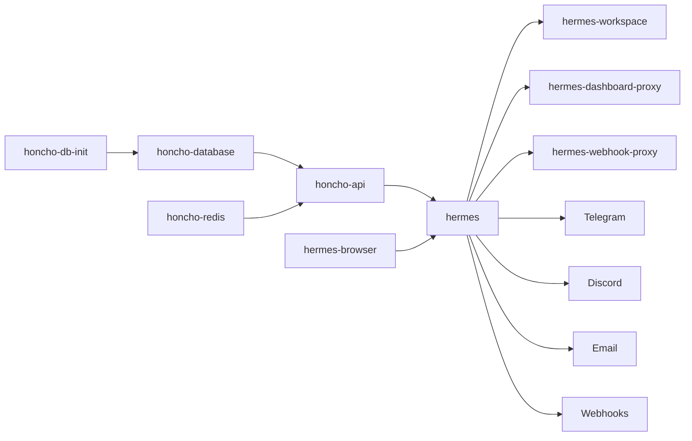
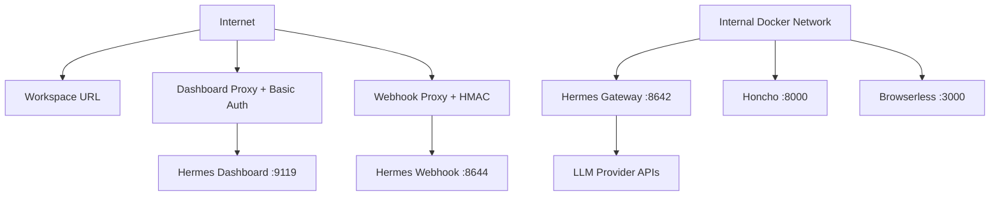

# Hermes Agent Coolify Stack

Production-friendly Coolify v4 deployment for:

- Hermes Agent gateway
- Hermes Workspace UI
- Protected Hermes dashboard
- Self-hosted Honcho memory
- Browserless / Chromium
- Telegram, Discord, Email, and Webhooks
- Optional Open WebUI frontend
- Coolify-native magic URLs and generated secrets

This repo is designed for people who want a practical self-hosted AI agent stack that can run on a VPS through Coolify with minimal manual secret management.

---

## What This Stack Gives You

| Component | Purpose | Public by Default? |
|---|---|---:|
| Hermes Agent | Main agent gateway and OpenAI-compatible API | No |
| Hermes Workspace | Web UI for using Hermes | Yes |
| Hermes Dashboard | Sessions, skills, config/dashboard API | Yes, but protected |
| Honcho | Long-term memory backend | No |
| Browserless | Persistent browser automation / CDP | No |
| Webhook Proxy | Public webhook endpoint for GitHub, GitLab, Stripe, etc. | Yes |
| Telegram | Chat with Hermes from Telegram | No separate URL |
| Discord | Chat with Hermes from Discord | No separate URL |
| Email | Email-based messaging | No separate URL |
| Open WebUI | Optional chat frontend | Optional |

---

## Architecture

```mermaid
flowchart TD
    U[User Browser] -->|HTTPS| CW[Coolify / Traefik Proxy]

    CW -->|Workspace URL| WS[Hermes Workspace :3000]
    CW -->|Dashboard URL + Basic Auth| DP[Dashboard Proxy :8080]
    CW -->|Webhook URL| WP[Webhook Proxy :8080]
    CW -->|Optional| OW[Open WebUI :8080]

    WS -->|Internal API| H[Hermes Agent :8642]
    WS -->|Internal Dashboard API| H9119[Hermes Dashboard Side Process :9119]

    DP -->|Internal| H9119
    WP -->|Internal| WH[Hermes Webhooks :8644]

    H -->|Memory| HC[Honcho API :8000]
    HC --> DB[(PostgreSQL + pgvector)]
    HC --> R[(Redis)]
    H --> B[Browserless Chromium :3000]

    H --> TG[Telegram]
    H --> DC[Discord]
    H --> EM[Email]
    OW -->|OpenAI-compatible API /v1| H
````

---

## Port Map

| Service                         | Internal Port | External Exposure                 |
| ------------------------------- | ------------: | --------------------------------- |
| `hermes` gateway                |        `8642` | Internal only                     |
| `hermes` dashboard side-process |        `9119` | Through protected dashboard proxy |
| `hermes` webhooks               |        `8644` | Through webhook proxy             |
| `hermes-workspace`              |        `3000` | Coolify public URL                |
| `hermes-dashboard-proxy`        |        `8080` | Coolify public URL + Basic Auth   |
| `hermes-webhook-proxy`          |        `8080` | Coolify public URL                |
| `hermes-browser`                |        `3000` | Internal only                     |
| `honcho-api`                    |        `8000` | Internal only                     |
| `open-webui`                    |        `8080` | Optional Coolify public URL       |

---

## Repo Layout

Recommended repository structure:

```text
.
├── README.md
├── docker-compose.yaml
├── docker-compose.openwebui.yaml        # optional
├── .env.example
└── docs/
    ├── troubleshooting.md              # optional
    └── security.md                     # optional
```

Minimum required files:

```text
docker-compose.yaml
.env.example
README.md
```

---

## Coolify Magic Variables Used

Coolify generates these automatically from the Compose file.

| Variable                              | Generated By Coolify | Used For                   |
| ------------------------------------- | -------------------- | -------------------------- |
| `SERVICE_URL_HERMESWORKSPACE_3000`    | URL                  | Public Workspace URL       |
| `SERVICE_FQDN_HERMESWORKSPACE_3000`   | FQDN                 | Workspace hostname         |
| `SERVICE_URL_HERMESDASHBOARD_8080`    | URL                  | Protected Dashboard URL    |
| `SERVICE_FQDN_HERMESDASHBOARD_8080`   | FQDN                 | Dashboard hostname         |
| `SERVICE_URL_HERMESWEBHOOKS_8080`     | URL                  | Public Webhook URL         |
| `SERVICE_FQDN_HERMESWEBHOOKS_8080`    | FQDN                 | Webhook hostname           |
| `SERVICE_PASSWORD_64_HERMESBRIDGE`    | Password             | Shared Hermes API token    |
| `SERVICE_PASSWORD_64_HERMESWORKSPACE` | Password             | Workspace login password   |
| `SERVICE_PASSWORD_64_HERMESBROWSER`   | Password             | Browserless token          |
| `SERVICE_PASSWORD_64_HERMESWEBHOOKS`  | Password             | Webhook HMAC global secret |
| `SERVICE_PASSWORD_HONCHODB`           | Password             | Honcho PostgreSQL password |

Important: avoid underscores inside Coolify magic identifiers when port suffixes are used. Use `HERMESWORKSPACE`, not `HERMES_WORKSPACE`.

Good:

```yaml
- SERVICE_URL_HERMESWORKSPACE_3000
```

Bad:

```yaml
- SERVICE_URL_HERMES_WORKSPACE_3000
```

---

## Environment Variables

Create this in Coolify under:

```text
Resource → Environment Variables → Developer View
```

Use `.env.example` as your starting point.

```env
###############################################################################
# Dashboard protection
###############################################################################

# REQUIRED because dashboard is exposed through hermes-dashboard-proxy.
#
# Generate:
#   htpasswd -nbB admin 'your-strong-password'
#
# Paste full output here.
#
# Example shape only:
#   DASHBOARD_BASIC_AUTH_USERS=admin:$2y$05$xxxxxxxxxxxxxxxxxxxxxxxxxxxxxxxxxxxxxxxxxxxxxxxxxxxxx
#
# In Coolify Developer View / .env, keep single $ characters.
# If writing the bcrypt hash directly in docker-compose labels, escape $ as $$.
DASHBOARD_BASIC_AUTH_USERS=

###############################################################################
# Hermes API / dashboard / webhooks
###############################################################################

API_SERVER_MODEL_NAME=hermes-agent

# First deploy: keep blank.
# After Coolify generates Workspace URL, optionally set:
# API_SERVER_CORS_ORIGINS=https://your-workspace-url.example.com
API_SERVER_CORS_ORIGINS=

# Optional dashboard TUI setting.
HERMES_DASHBOARD_TUI=

WEBHOOK_ENABLED=true

###############################################################################
# Hermes LLM provider keys
###############################################################################

# Fill at least one provider key.
OPENROUTER_API_KEY=
OPENAI_API_KEY=
ANTHROPIC_API_KEY=
GOOGLE_API_KEY=
GEMINI_API_KEY=
GROQ_API_KEY=
MISTRAL_API_KEY=

###############################################################################
# Honcho self-hosted memory
###############################################################################

# Honcho requires at least one usable LLM provider key.
#
# OpenAI:
#   HONCHO_LLM_OPENAI_API_KEY=sk-...
#   HONCHO_OPENAI_BASE_URL=
#
# OpenRouter:
#   HONCHO_LLM_OPENAI_API_KEY=sk-or-v1-...
#   HONCHO_OPENAI_BASE_URL=https://openrouter.ai/api/v1
#   HONCHO_MODEL=openai/gpt-4.1-mini
#
# Local vLLM/LiteLLM/Ollama on host:
#   HONCHO_OPENAI_BASE_URL=http://host.docker.internal:8000/v1
HONCHO_LLM_OPENAI_API_KEY=
HONCHO_LLM_ANTHROPIC_API_KEY=
HONCHO_LLM_GEMINI_API_KEY=

HONCHO_TRANSPORT=openai
HONCHO_MODEL=gpt-5.4-mini
HONCHO_OPENAI_BASE_URL=
HONCHO_EMBED_MESSAGES=true
HONCHO_EMBEDDING_TRANSPORT=openai
HONCHO_EMBEDDING_MODEL=text-embedding-3-small
HONCHO_LOG_LEVEL=INFO

# Local/self-hosted Honcho normally does not need an API key for Hermes.
HONCHO_API_KEY=
HINDSIGHT_TIMEOUT=120

###############################################################################
# Browserless
###############################################################################

BROWSER_KEEP_ALIVE=true
BROWSER_CONCURRENT=3
BROWSER_QUEUED=3
BROWSER_TIMEOUT_MS=300000
BROWSER_INACTIVITY_TIMEOUT=900

###############################################################################
# Telegram
###############################################################################

# Example token shape:
# TELEGRAM_BOT_TOKEN=123456789:ABCdefGHIjklMNOpqrSTUvwxYZ
TELEGRAM_BOT_TOKEN=

# Comma-separated Telegram numeric user IDs.
# Example:
# TELEGRAM_ALLOWED_USERS=123456789,987654321
TELEGRAM_ALLOWED_USERS=

# Optional group controls.
TELEGRAM_GROUP_ALLOWED_USERS=
TELEGRAM_GROUP_ALLOWED_CHATS=

###############################################################################
# Discord
###############################################################################

DISCORD_BOT_TOKEN=
DISCORD_ALLOWED_USERS=
DISCORD_ALLOWED_ROLES=
DISCORD_HOME_CHANNEL=

###############################################################################
# Email
###############################################################################

EMAIL_ADDRESS=
EMAIL_PASSWORD=
EMAIL_IMAP_HOST=
EMAIL_SMTP_HOST=
EMAIL_IMAP_PORT=993
EMAIL_SMTP_PORT=587
EMAIL_POLL_INTERVAL=15
EMAIL_ALLOWED_USERS=
EMAIL_HOME_ADDRESS=
EMAIL_ALLOW_ALL_USERS=false

###############################################################################
# Workspace
###############################################################################

STREAM_ACCEPTED_TIMEOUT_MS=120000
STREAM_HANDOFF_TIMEOUT_MS=300000

VITE_HERMESWORLD_ENABLED=1
VITE_PLAYGROUND_WS_URL=
VITE_PLAYGROUND_STATS_URL=

###############################################################################
# Optional Open WebUI
###############################################################################

# Same-stack Open WebUI:
OPENWEBUI_OPENAI_API_BASE_URL=http://hermes:8642/v1

# Separate Open WebUI container on same Docker host:
# OPENWEBUI_OPENAI_API_BASE_URL=http://host.docker.internal:8642/v1

OPENWEBUI_ENABLE_OLLAMA_API=false
```

---

## Generate Dashboard Basic Auth

Install `htpasswd` locally.

### macOS

```bash
brew install httpd
```

### Ubuntu / Debian

```bash
sudo apt-get update
sudo apt-get install -y apache2-utils
```

Generate credentials:

```bash
htpasswd -nbB admin 'change-this-strong-password'
```

Example output shape:

```text
admin:$2y$05$w1xxxxxxxxxxxxxxxxxxxxxxxxxxxxxxxxxxxxxxxxxxxxxxxxxxxxxxx
```

Paste it into Coolify:

```env
DASHBOARD_BASIC_AUTH_USERS=admin:$2y$05$w1xxxxxxxxxxxxxxxxxxxxxxxxxxxxxxxxxxxxxxxxxxxxxxxxxxxxxxx
```

Notes:

* In `.env` / Coolify Developer View, use single `$`.
* If placing the hash directly inside a Compose label, use `$$`.
* Dashboard protection is intentionally done through a proxy service so webhook callbacks are not affected by Basic Auth.

---

## Deployment Options

### Option A — Main stack only

Use:

```text
docker-compose.yaml
```

This includes:

* Hermes
* Workspace
* protected dashboard proxy
* webhook proxy
* Honcho
* Browserless

### Option B — Add Open WebUI

Use both files:

```text
docker-compose.yaml
docker-compose.openwebui.yaml
```

In Coolify, either combine the Open WebUI service into your main Compose file or deploy it as a second Compose resource.

---

## Quick Start on Coolify

### 1. Create Resource

1. Open Coolify.
2. Select project.
3. Click **New Resource**.
4. Choose **Docker Compose**.
5. Connect your GitHub repo.
6. Set Compose file path:

```text
/docker-compose.yaml
```

### 2. Add Environment Variables

Go to:

```text
Environment Variables → Developer View
```

Paste the `.env.example` contents and fill:

Required:

```env
DASHBOARD_BASIC_AUTH_USERS=
```

At least one Hermes model provider:

```env
OPENROUTER_API_KEY=
# or
OPENAI_API_KEY=
# or
ANTHROPIC_API_KEY=
# or
GOOGLE_API_KEY=
```

At least one Honcho model provider:

```env
HONCHO_LLM_OPENAI_API_KEY=
# or
HONCHO_LLM_ANTHROPIC_API_KEY=
# or
HONCHO_LLM_GEMINI_API_KEY=
```

Optional messaging:

```env
TELEGRAM_BOT_TOKEN=
TELEGRAM_ALLOWED_USERS=
DISCORD_BOT_TOKEN=
EMAIL_ADDRESS=
EMAIL_PASSWORD=
```

### 3. Deploy

Click:

```text
Deploy
```

Coolify should generate URLs for:

```text
Hermes Workspace
Hermes Dashboard Proxy
Hermes Webhooks Proxy
```

### 4. Open Workspace

Open:

```text
SERVICE_URL_HERMESWORKSPACE_3000
```

Login password is generated by Coolify:

```text
SERVICE_PASSWORD_64_HERMESWORKSPACE
```

Reveal it in Coolify environment variables.

### 5. Open Dashboard

Open:

```text
SERVICE_URL_HERMESDASHBOARD_8080
```

Browser will ask for Basic Auth.

Use the username/password you generated using `htpasswd`.

### 6. Optional: Set CORS After First Deploy

After Coolify generates your Workspace URL:

```env
API_SERVER_CORS_ORIGINS=https://your-workspace-url.example.com
```

Redeploy.

---

## Main `docker-compose.yaml`

Use the latest Compose file from this repo. The important patterns are:

### Dashboard is inside `hermes`

```yaml
- HERMES_DASHBOARD=1
- HERMES_DASHBOARD_HOST=0.0.0.0
- HERMES_DASHBOARD_PORT=9119
```

### Workspace talks internally

```yaml
- HERMES_API_URL=http://hermes:8642
- HERMES_DASHBOARD_URL=http://hermes:9119
```

### Do not set Workspace dashboard token unless you know the real bearer

Wrong explicit dashboard token can cause:

```text
Failed to load sessions.
Hermes Agent dashboard /api/sessions?limit=50&offset=0: 401 {"detail":"Unauthorized"}
```

Keep only:

```yaml
- HERMES_DASHBOARD_URL=http://hermes:9119
```

Do not add:

```yaml
- HERMES_DASHBOARD_TOKEN=...
- CLAUDE_DASHBOARD_TOKEN=...
```

unless you know the exact dashboard bearer.

---

## Service Dependency Graph



---

## Data Persistence

| Volume              | Stores                                             |
| ------------------- | -------------------------------------------------- |
| `hermes-data`       | Hermes config, sessions, skills, memory/cache data |
| `workspace-data`    | Workspace settings and overrides                   |
| `browser-data`      | Browserless data/profile/session cache             |
| `honcho-pgdata`     | Honcho PostgreSQL memory database                  |
| `honcho-redis-data` | Honcho Redis cache                                 |
| `open-webui-data`   | Optional Open WebUI data                           |

Backup these volumes before major upgrades.

---

## Backup Commands

On the server:

```bash
docker volume ls
```

Example backup for Postgres volume through container dump:

```bash
docker exec -t <honcho-database-container> pg_dump -U honcho honcho > honcho-backup.sql
```

Restore example:

```bash
cat honcho-backup.sql | docker exec -i <honcho-database-container> psql -U honcho -d honcho
```

Backup Hermes data volume from a temporary container:

```bash
docker run --rm \
  -v <project>_hermes-data:/data \
  -v "$PWD":/backup \
  alpine \
  tar czf /backup/hermes-data-backup.tar.gz -C /data .
```

---

## Updating

In Coolify:

```text
Redeploy → Force Pull Latest Images
```

For manual Docker:

```bash
docker compose pull
docker compose up -d --force-recreate
```

For Honcho, if built from Git source:

```bash
docker compose build --no-cache honcho-api honcho-deriver
docker compose up -d
```

---

## Honcho Memory

Hermes connects to self-hosted Honcho using:

```env
HONCHO_BASE_URL=http://honcho-api:8000
```

Local Honcho usually does not need:

```env
HONCHO_API_KEY
```

Honcho itself still needs an LLM provider.

### OpenAI Example

```env
HONCHO_LLM_OPENAI_API_KEY=sk-...
HONCHO_OPENAI_BASE_URL=
HONCHO_TRANSPORT=openai
HONCHO_MODEL=gpt-5.4-mini
HONCHO_EMBEDDING_MODEL=text-embedding-3-small
```

### OpenRouter Example

```env
HONCHO_LLM_OPENAI_API_KEY=sk-or-v1-...
HONCHO_OPENAI_BASE_URL=https://openrouter.ai/api/v1
HONCHO_TRANSPORT=openai
HONCHO_MODEL=openai/gpt-4.1-mini
HONCHO_EMBEDDING_MODEL=openai/text-embedding-3-small
```

### Local LLM Example

For LiteLLM/vLLM/Ollama OpenAI-compatible endpoint on the Docker host:

```env
HONCHO_OPENAI_BASE_URL=http://host.docker.internal:8000/v1
HONCHO_LLM_OPENAI_API_KEY=dummy-or-real-key
```

The Compose includes:

```yaml
extra_hosts:
  - "host.docker.internal:host-gateway"
```

---

## Messaging Setup

### Telegram

Create a Telegram bot:

1. Open Telegram.
2. Search `@BotFather`.
3. Send:

```text
/newbot
```

4. Copy the token.

Set:

```env
TELEGRAM_BOT_TOKEN=123456789:ABCdefGHIjklMNOpqrSTUvwxYZ
TELEGRAM_ALLOWED_USERS=123456789
```

Find your Telegram user ID by messaging a bot like `@userinfobot` or by checking update payloads.

Group example:

```env
TELEGRAM_GROUP_ALLOWED_USERS=123456789,987654321
TELEGRAM_GROUP_ALLOWED_CHATS=-1001234567890
```

### Discord

Create a Discord bot in the Discord Developer Portal.

Set:

```env
DISCORD_BOT_TOKEN=
DISCORD_ALLOWED_USERS=
DISCORD_ALLOWED_ROLES=
DISCORD_HOME_CHANNEL=
```

### Email

Example Gmail-style app password setup:

```env
EMAIL_ADDRESS=agent@example.com
EMAIL_PASSWORD=your-app-password
EMAIL_IMAP_HOST=imap.gmail.com
EMAIL_SMTP_HOST=smtp.gmail.com
EMAIL_IMAP_PORT=993
EMAIL_SMTP_PORT=587
EMAIL_ALLOWED_USERS=you@example.com
EMAIL_ALLOW_ALL_USERS=false
```

Use app passwords where available. Do not use your main mailbox password.

### Webhooks

Hermes webhook listener runs internally on:

```text
http://hermes:8644
```

Public URL is generated by Coolify:

```text
SERVICE_URL_HERMESWEBHOOKS_8080
```

Webhook endpoint shape:

```text
https://your-webhook-url/webhooks/<route-name>
```

Health check:

```bash
curl https://your-webhook-url/health
```

Expected shape:

```json
{"status":"ok","platform":"webhook"}
```

---

## Webhook Example: GitHub Pull Request Route

Inside the Hermes container, create or edit config according to Hermes webhook route syntax.

Conceptual route:

```yaml
platforms:
  webhook:
    enabled: true
    port: 8644
    secret: "${WEBHOOK_SECRET}"
    extra:
      routes:
        github-pr-review:
          events:
            - pull_request
          secret: "${WEBHOOK_SECRET}"
          prompt: |
            Review this GitHub pull request.
            Title: {pull_request.title}
            Body: {pull_request.body}
            Author: {pull_request.user.login}
          deliver: log
```

GitHub webhook URL:

```text
https://your-webhook-url/webhooks/github-pr-review
```

Use HMAC secret:

```text
SERVICE_PASSWORD_64_HERMESWEBHOOKS
```

---

## Optional Open WebUI

Open WebUI connects to Hermes through Hermes’ OpenAI-compatible API.

Same-stack URL:

```env
OPENWEBUI_OPENAI_API_BASE_URL=http://hermes:8642/v1
```

Separate container on the same Docker host:

```env
OPENWEBUI_OPENAI_API_BASE_URL=http://host.docker.internal:8642/v1
```

Required:

```yaml
extra_hosts:
  - "host.docker.internal:host-gateway"
```

Open WebUI connection:

| Field    | Value                              |
| -------- | ---------------------------------- |
| URL      | `http://hermes:8642/v1`            |
| API Key  | `SERVICE_PASSWORD_64_HERMESBRIDGE` |
| API Mode | Chat Completions recommended       |

If using the Open WebUI Admin UI:

1. Open Open WebUI.
2. Go to **Admin Settings**.
3. Go to **Connections**.
4. Add OpenAI-compatible connection.
5. URL:

```text
http://hermes:8642/v1
```

6. API Key:

```text
SERVICE_PASSWORD_64_HERMESBRIDGE
```

Note: Open WebUI stores connection settings in its database after first launch. Changing environment variables later may not update existing Open WebUI connection settings. Use Admin UI or reset the Open WebUI volume.

---

## Security Model



### Recommended exposure

| Component   | Recommendation                       |
| ----------- | ------------------------------------ |
| Workspace   | Public, password protected           |
| Dashboard   | Public only through Basic Auth proxy |
| Gateway API | Internal only                        |
| Honcho      | Internal only                        |
| Browserless | Internal only                        |
| Webhooks    | Public, HMAC protected               |

---

## Production Hardening Checklist

Before exposing this stack:

* [ ] `DASHBOARD_BASIC_AUTH_USERS` is set.
* [ ] Dashboard is exposed only through `hermes-dashboard-proxy`.
* [ ] `hermes` gateway has no direct public URL.
* [ ] Browserless has no public URL.
* [ ] Honcho has no public URL.
* [ ] Webhook secret is generated by Coolify.
* [ ] Telegram allowed users are set.
* [ ] Discord allowed users/roles are set.
* [ ] Email allowed users are set.
* [ ] At least one Hermes LLM provider key is configured.
* [ ] At least one Honcho LLM provider key is configured.
* [ ] CORS is tightened after first deploy.
* [ ] Volumes are backed up before upgrades.
* [ ] Coolify project is not using custom Docker networks.
* [ ] No `container_name` is used.
* [ ] No unnecessary host `ports:` are used.

---

## Validation Commands

### From Coolify terminal: Hermes container

```bash
curl -fsS http://localhost:8642/health
```

Dashboard:

```bash
curl -fsS http://localhost:9119/api/status || curl -fsS http://localhost:9119/
```

Webhooks:

```bash
curl -fsS http://localhost:8644/health
```

### From Workspace container

```bash
curl -fsS http://hermes:8642/health
curl -fsS http://hermes:9119/api/status || curl -fsS http://hermes:9119/
```

### From Hermes container to Honcho

```bash
curl -fsS http://honcho-api:8000/docs
```

### From Open WebUI container

```bash
curl -fsS http://hermes:8642/v1/models
```

or if using host mapping:

```bash
curl -fsS http://host.docker.internal:8642/v1/models
```

---

## Health Matrix

| Check                 | Command                                 | Expected             |
| --------------------- | --------------------------------------- | -------------------- |
| Hermes gateway        | `curl http://localhost:8642/health`     | 200 / healthy        |
| Hermes dashboard      | `curl http://localhost:9119/api/status` | 200 or fallback HTML |
| Hermes webhooks       | `curl http://localhost:8644/health`     | webhook health JSON  |
| Honcho API            | `curl http://honcho-api:8000/docs`      | Swagger/OpenAPI HTML |
| Workspace → gateway   | `curl http://hermes:8642/health`        | 200                  |
| Workspace → dashboard | `curl http://hermes:9119/api/status`    | 200 or fallback HTML |
| Open WebUI → Hermes   | `curl http://hermes:8642/v1/models`     | model list           |

---

## Common Errors and Fixes

### 1. Workspace: `Failed to load sessions` / dashboard 401

Error:

```text
Failed to load sessions.
Hermes Agent dashboard /api/sessions?limit=50&offset=0: 401 {"detail":"Unauthorized"}
```

Fix:

Remove these from Workspace env:

```env
HERMES_DASHBOARD_TOKEN=
CLAUDE_DASHBOARD_TOKEN=
```

Keep:

```env
HERMES_DASHBOARD_URL=http://hermes:9119
```

Clear old Workspace overrides:

```bash
rm -f /home/workspace/.hermes/workspace-overrides.json
```

Restart `hermes-workspace`.

---

### 2. Dashboard opens without password

Cause:

You exposed `hermes:9119` directly instead of using `hermes-dashboard-proxy`.

Fix:

Remove direct dashboard URL magic vars from the `hermes` service.

Use:

```yaml
hermes-dashboard-proxy:
  labels:
    - "traefik.http.middlewares.hermes-dashboard-auth.basicauth.users=${DASHBOARD_BASIC_AUTH_USERS}"
    - "coolify.traefik.middlewares=hermes-dashboard-auth"
```

---

### 3. Webhooks fail because of Basic Auth

Cause:

Basic Auth middleware was attached to the main `hermes` service, so it protects webhooks too.

Fix:

Use separate proxies:

```text
hermes-dashboard-proxy → dashboard :9119 + Basic Auth
hermes-webhook-proxy → webhooks :8644 + no Basic Auth
```

Webhook security should be HMAC-based, not dashboard Basic Auth.

---

### 4. Honcho fails to start

Likely cause:

No LLM provider configured.

Set at least one:

```env
HONCHO_LLM_OPENAI_API_KEY=
HONCHO_LLM_ANTHROPIC_API_KEY=
HONCHO_LLM_GEMINI_API_KEY=
```

For OpenRouter:

```env
HONCHO_LLM_OPENAI_API_KEY=sk-or-v1-...
HONCHO_OPENAI_BASE_URL=https://openrouter.ai/api/v1
HONCHO_MODEL=openai/gpt-4.1-mini
```

---

### 5. Honcho build fails in Coolify

Some Coolify/server setups may reject remote Git build contexts.

If this fails:

```yaml
build:
  context: https://github.com/plastic-labs/honcho.git#main
```

Use one of these:

#### Option A — Fork Honcho into your repo

```text
vendor/honcho/
```

Then:

```yaml
build:
  context: ./vendor/honcho
```

#### Option B — Use honcho-self-hosted overlay

Clone:

```bash
git clone https://github.com/elkimek/honcho-self-hosted.git
```

Adapt its Honcho files into your repo.

---

### 6. Open WebUI cannot find models

Use `/v1`.

Correct:

```env
OPENWEBUI_OPENAI_API_BASE_URL=http://hermes:8642/v1
```

Wrong:

```env
OPENWEBUI_OPENAI_API_BASE_URL=http://hermes:8642
```

If Open WebUI is separate from the stack:

```env
OPENWEBUI_OPENAI_API_BASE_URL=http://host.docker.internal:8642/v1
```

and add:

```yaml
extra_hosts:
  - "host.docker.internal:host-gateway"
```

---

### 7. `host.docker.internal` does not resolve

Add this to services needing host access:

```yaml
extra_hosts:
  - "host.docker.internal:host-gateway"
```

This is included for Hermes, Honcho API, Honcho Deriver, and Open WebUI where relevant.

---

### 8. Telegram bot does not respond

Check:

```env
TELEGRAM_BOT_TOKEN=
TELEGRAM_ALLOWED_USERS=
```

Common issues:

* Bot token wrong.
* User ID missing.
* Using Telegram username instead of numeric user ID.
* Bot privacy mode blocks group messages.
* Bot not added to group.
* Group chat ID missing from `TELEGRAM_GROUP_ALLOWED_CHATS`.

---

### 9. Email works for sending but not receiving

Check:

```env
EMAIL_IMAP_HOST=
EMAIL_IMAP_PORT=993
```

For Gmail/Google Workspace:

* Use App Password.
* IMAP must be enabled.
* Do not use your normal account password.

---

### 10. Coolify magic variables are blank

Check:

* You used normal Docker Compose resource, not an unsupported raw mode.
* Coolify version supports magic variables.
* The variable is declared in a service environment block.
* Identifier has no underscore before port suffix.
* You redeployed after adding the variable.

---

## Local Development

Create a local `.env` by replacing Coolify magic variables manually.

Example:

```env
SERVICE_PASSWORD_64_HERMESBRIDGE=local-hermes-secret
SERVICE_PASSWORD_64_HERMESWORKSPACE=local-workspace-password
SERVICE_PASSWORD_64_HERMESBROWSER=local-browser-token
SERVICE_PASSWORD_64_HERMESWEBHOOKS=local-webhook-secret
SERVICE_PASSWORD_HONCHODB=local-db-password

DASHBOARD_BASIC_AUTH_USERS=admin:$2y$05$...
OPENAI_API_KEY=sk-...
HONCHO_LLM_OPENAI_API_KEY=sk-...
```

Run:

```bash
docker compose up -d
```

Check logs:

```bash
docker compose logs -f hermes
docker compose logs -f hermes-workspace
docker compose logs -f honcho-api
```

---

## Manual Open WebUI Docker Command

If running Open WebUI separately:

```bash
docker run -d \
  -p 3000:8080 \
  -e OPENAI_API_BASE_URL=http://host.docker.internal:8642/v1 \
  -e OPENAI_API_KEY=your-hermes-api-key \
  -e ENABLE_OLLAMA_API=false \
  --add-host=host.docker.internal:host-gateway \
  -v open-webui:/app/backend/data \
  --name open-webui \
  --restart always \
  ghcr.io/open-webui/open-webui:main
```

---

## Upgrade Path

### Safe Upgrade

1. Backup volumes.
2. Force pull images.
3. Rebuild Honcho if using build context.
4. Redeploy.
5. Validate health checks.

Commands:

```bash
docker compose pull
docker compose build --no-cache honcho-api honcho-deriver
docker compose up -d --force-recreate
```

### Rollback

If a deployment fails:

1. Revert Git commit.
2. Redeploy previous Compose.
3. Restore database backup if migrations corrupted data.
4. Clear bad Workspace override file if needed:

```bash
rm -f /home/workspace/.hermes/workspace-overrides.json
```

---

## Known Sharp Edges

| Area                        | Risk                          | Mitigation                          |
| --------------------------- | ----------------------------- | ----------------------------------- |
| Dashboard exposure          | Sensitive config/API controls | Use Basic Auth proxy                |
| Webhooks                    | Public endpoint               | Use HMAC secret                     |
| Honcho                      | Requires LLM provider         | Set Honcho provider key             |
| Honcho remote build         | May fail in Coolify           | Vendor Honcho or use overlay repo   |
| Open WebUI env changes      | Stored after first launch     | Change via Admin UI or reset volume |
| Browserless public exposure | Browser takeover risk         | Keep internal                       |
| Telegram bot token leak     | Anyone can control bot        | Revoke via BotFather                |
| Email password leak         | Mailbox takeover              | Use app password                    |
| Workspace overrides         | Can override Compose env      | Delete `workspace-overrides.json`   |

---

## Adoption Checklist

### First deploy

* [ ] Add `docker-compose.yaml`.
* [ ] Add `.env.example`.
* [ ] Add this `README.md`.
* [ ] Create Coolify Docker Compose resource.
* [ ] Paste env in Developer View.
* [ ] Generate dashboard Basic Auth.
* [ ] Add at least one Hermes provider key.
* [ ] Add at least one Honcho provider key.
* [ ] Deploy.
* [ ] Open Workspace URL.
* [ ] Open Dashboard URL.
* [ ] Test webhook health.
* [ ] Optional: configure Telegram.
* [ ] Optional: configure Discord.
* [ ] Optional: configure Email.
* [ ] Optional: deploy Open WebUI.

### After first deploy

* [ ] Set `API_SERVER_CORS_ORIGINS`.
* [ ] Backup volumes.
* [ ] Confirm dashboard is Basic Auth protected.
* [ ] Confirm gateway is not public.
* [ ] Confirm Browserless is not public.
* [ ] Confirm Honcho is not public.
* [ ] Confirm Telegram allowed users are set.
* [ ] Confirm Email allowed users are set.

---

## References

* Coolify Docker Compose magic environment variables
* Hermes Agent Docker and dashboard docs
* Hermes Agent webhook docs
* Hermes Agent Telegram docs
* Honcho self-hosting docs
* Honcho self-hosted overlay repo
* Open WebUI Hermes integration docs

The README above assumes your repo already contains the improved `docker-compose.yaml` and optional `docker-compose.openwebui.yaml`.
::contentReference[oaicite:1]{index=1}

[1]: https://coolify.io/docs/knowledge-base/docker/compose "Docker Compose | Coolify Docs"
